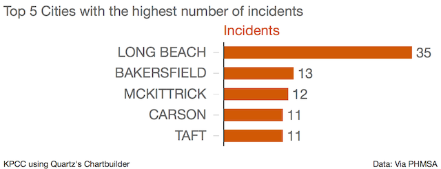
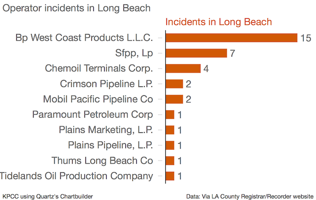

California Pipeline Operator Data 
====================================

The data was scraped from [here](http://primis.phmsa.dot.gov/comm/reports/operator/OperatorListNoJS.html) using two web scrapers. Details on those can be found in our [tools and scripts folder](https://github.com/SCPR/kpcc-data-team/tree/wcraft-dev/tools-and-scripts/pull-california-pipeline-operators)

Analyzing the data 
------------------
Guiding Questions 

* Who are the biggest offenders in California?
* Is there a relation between mileage operated and number of incidents? What are the incidences per mile? 
* What is the most common cause of pipeline failure?
* What areas have been hit the hardest? 

There are 98 companies operating pipeline in CA. There have been 273 incidents in California since 2006, caused by 34 different pipeline operators. However, the majority of the incidents have been caused by a small number of companies.

However, this doesn't give us a full picture for the worst offenders in the state, because some of the companies operate vastly different quantities of pipeline.

Calculating the number of incidents per mile gives us a better idea of which companies have pipelines that are consistently breaking. We can see that Bp West Coast has a very high number of incidents per mile, even though they only have 161 miles. 

There have been 9 fatalities and 62 injuries, all caused by the same pipeline operator, Pacific Gas and Electric, in two separate incidences. The largest incident, [the San Bruno pipeline explosion](http://www.scpr.org/news/2015/04/09/50901/california-regulator-suggests-utility-pg-e-is-too/), caused over $300 million in damages and killed 8 people.

In total, 6,054,736 barrels of hazardous liquid have been spilled by 31 different operators since 2006. Only three operators spilled more than 10,000 barrels. The next highest spiller lost 7,218 barrels. A huge part of PG&E's lead is the San Bruno explosion.

The most common cause of pipeline failures are material/weld/equipment failure and corrosion. 

Long Beach is by far the city with the highest number of incidents, which may make sense given that Long Beach is right next to the Port of Long Beach, one of the busiest in the world. Though the port is actually in Los Angeles, it makes sense that there would be a lot of operators in the city.

However, looking only within Long Beach, we can see which pipelines have the highest incident rate. Using the collected data, we could replicate this for any city in California. 

