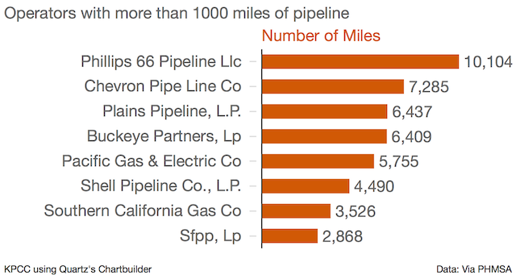
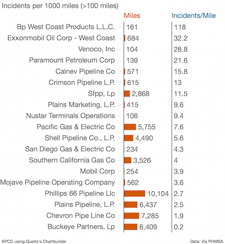
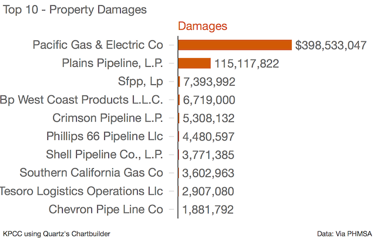
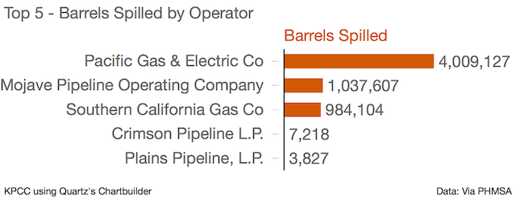

California Pipeline Operator Data
====================================

The data was scraped from [here](http://primis.phmsa.dot.gov/comm/reports/operator/OperatorListNoJS.html) using two web scrapers. Details on those can be found in our [tools and scripts folder](/tools-and-scripts/pull-us-pipeline-operators)

Analyzing the data
------------------

**Guiding Questions**

* Who are the biggest offenders in California?
* Is there a relation between mileage operated and number of incidents? What are the incidences per mile?
* What is the most common cause of pipeline failure?
* What areas have been hit the hardest?

According to data from August, 2015:
* there are 98 companies operating pipeline in California
* there have been 273 incidents in California since 2006, caused by 34 different pipeline operators
    * the majority of the incidents have been caused by a handful of companies.

However, this doesn't give us a full picture for the worst offenders in the state, because some of the companies operate vastly different quantities of pipeline.

Calculating the number of incidents per mile gives us a better idea of which companies have pipelines that are consistently breaking. We can see that Bp West Coast has a very high number of incidents per mile, even though they only have 161 miles.

There have been 9 fatalities and 62 injuries, all caused by the same pipeline operator, Pacific Gas and Electric, in two separate incidences. The largest incident, [the San Bruno pipeline explosion](http://www.scpr.org/news/2015/04/09/50901/california-regulator-suggests-utility-pg-e-is-too/), caused over $300 million in damages and killed 8 people.

In total, 6,054,736 barrels of hazardous liquid have been spilled by 31 different operators since 2006. Only three operators spilled more than 10,000 barrels. The next highest spiller lost 7,218 barrels. A huge part of PG&E's lead is the San Bruno explosion.

The most common cause of pipeline failures are material/weld/equipment failure and corrosion.

Long Beach is by far the city with the highest number of incidents, which may make sense given that Long Beach is right next to the Port of Long Beach, one of the busiest in the world. Though the port is actually in Los Angeles, it makes sense that there would be a lot of operators in the city.

However, looking only within Long Beach, we can see which pipelines have the highest incident rate. Using the collected data, we could replicate this for any city in California.

Explanation of Data Fields
--------------------------

No government dataset would be complete without some jargon, so here is an attempt to explain the data in each column for the two csv files.

**pipeline-incident-details.csv**

* **Operator**
    * The name of the company operating the pipeline

* **Date**
    * The date that the incident occured

* **System**
    * Lists which of the three systems, hazardous liquid (HL), gas gathering (GG), or gas transmission (GT), the pipe that broke was

* **City**
    * The city the pipeline was in

* **State**
    * The state the pipeline was in

* **County**
    * The county the pipeline was in

* **Cause**
    * The cause for the pipeline incident. There are 7 possible causes: material/weld/equipment failure, corrosion, excavation damage, incorrect operation, natural force damage, other outside force damage, and all other causes

* **Sub Cause**
    * a brief explanation of what caused the failure.

* **Fatalities**
    * The number of people that died due to the incident

* **Injuries**
    * The number of people that were injured due to the incident

* **Property Damage (A)**
    * The estimated sum of damages caused by the incident, estimated and reported by the operator

* **Gross Barrels Spilled (Haz Liq) (B)**
    * The total amount of hazardous liquid spilled during the incident

* **Net Barrels Lost (Haz Liq) (B)(C)**
    * The total amount of hl spilled minus the amount of hl recovered

* **Value of Product Lost (D)**
    * The monetary value of the product lost due to the incident

**california_pipeline_operators.csv**

* **id**
    * Each pipeline operator has a unique ID number

* **california**
    * "True" if the operator has ANY pipeline in California

* **name**
    * The name of the company

* **incidents**
    * This number if from the main list of operators, but is not always accurate (part of the reason for the other scraper). Check each operator page for a more accurate incident details.

* **inspections**
    * Inspections are meant to ensure compliance with government safety regulations. More information on inspections and enforcement action can be found [here](http://phmsa.dot.gov/inspect-enforce) and information on inspections, such as number of investigators, can be found [here](http://phmsa.dot.gov/pipeline/inspections)

* **enforcement-actions**
    * When a company is found to be noncompliant, PHMSA can take enforcement actions against them. This is the number of enforcement actions levied agains this operator

* **hazardous-liquid**
    * You can check the full list of possible fluids and gases transported [here](http://primis.phmsa.dot.gov/comm/FactSheets/FSProductList.htm?nocache=2022), but in general, PHMSA defines hazardous liquids as "hydrocarbon liquids", so crude oil and refined petroleum.

* **states-of-operation-hl**
    * Which states the operator has hazardous liquid pipelines in.

* **inspected-miles-hl**
    * Federal and state inspected miles: Pipeline operators have to submit to both federal and state inspections. Information of the various state regulators can be found [here](http://phmsa.dot.gov/pipeline/state-programs) and information on the federal laws that must be obeyed can be read [here](http://phmsa.dot.gov/pipeline/stateprograms/federalstateauthorities)

* **gas-transmission**
    * Gas pipelines transport non-liquid products such as butane and natural gas

* **states-of-operation-gt**
    * Which states the operator has gas transmission pipelines in.

* **inspected-miles-gt**

* **gas-gathering**
    * These are pipes used for gathering, as opposed to transporting, gas

* **states-of-operation-gg**
    * Which states the operator has gas transmission pipelines in.

* **inspected-miles-gg**
