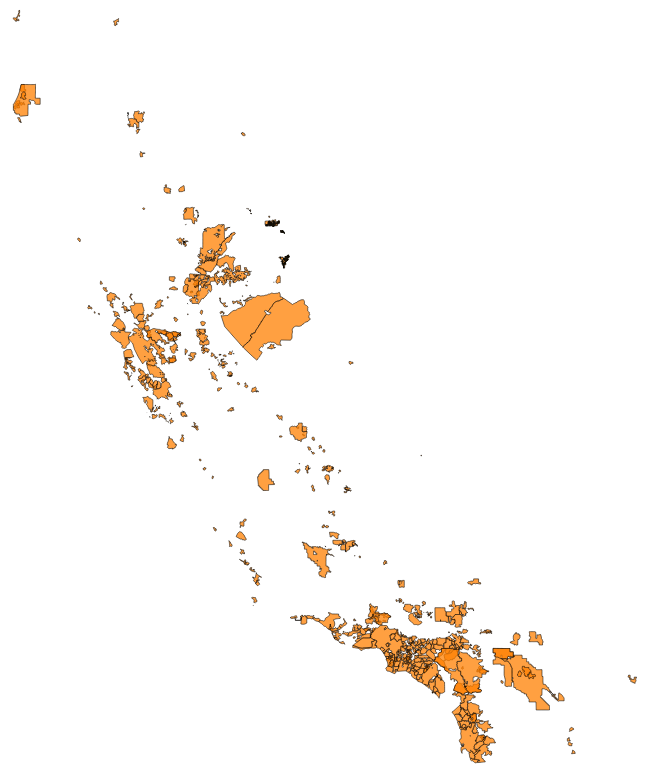

# Water district shapefiles in California

In 2015, its fourth year of drought, California began imposing mandatory cutbacks on hundreds of urban water suppliers across the state. In 2016, the state allowed suppliers to set their own reduction targets. Many set those targets at zero.

Nevertheless, the [State Water Resources Control Board](http://www.waterboards.ca.gov/) continues to report [urban water use each month](http://www.waterboards.ca.gov/water_issues/programs/conservation_portal/conservation_reporting.shtml).

Exactly *where* are those urban districts, and what are their service areas? What geographic patterns can we find in water use?

These are surprisingly difficult questions to answer. **There is no central repository of water district shapefiles** in the state, according to the [Department of Water Resources](http://www.water.ca.gov/).

Available data "comes from a wide range of sources of a wide range of qualities," DWR spokeswoman Lauren Bisnett said. "There isn’t a better water agency dataset in existence to our knowledge, but ours should be considered a rough."

It is indeed rough. Many service areas in the dataset overlap, something that should not occur, and adjoining districts fit together like jagged puzzle pieces. One example is Los Angeles and San Fernando.

One other consideration: water district service areas frequently change.

# What's here

The [urban_water_districts.geojson file](urban_water_districts.geojson) is based on [GIS data initially compiled by the DWR](https://gis.water.ca.gov/app/boundaries/).

KPCC then matched more than 380 of the districts with data compiled by the State Water Resources Control Board monthly urban water use reports.

The attribute table also includes all the fields provided by the Department of Water Resource.

We are also attaching a [swrcb_water_district_name_key.csv](swrcb_water_district_name_key.csv) which was the "key" used to join the SWRCB data to the DWR's GIS data.

This csv file contains the following fields:

* *agency_unique*:
* *swcrb_name*:
* *supplier_name_proper*: Water agency name as human-readable string
* *supplier_name_slug*: Water agency name as human-readable slug
* *hydrologic_region*: Water agency's hydrologic region as human-readable string
* *hydrologic_region_slug*: Water agency's hydrologic region as human-readable string
* *june_5_reduction_target*: Water agency's expected savings set by SWRCB on June 5, 2015 and in effect between June 2015 and Feb. 2016.
* *march_1_reduction_target*: Water agency's revised expected savings set by SWRCB in March 2016 and in effect between June 2015 and June 2016.
* *cumulative_reduction_percent*: Water agency's cumulative reduction as a percent.
* *reached_reduction_target*: Boolean as to whether a water agency reached its March 1 expected savings target.
* *stress_test_reduction_target*: Results of water agency's documentation to expected savings set by SWRCB with a locally-determined savings figure.

This csv file by itself this will not produce the geojson in this repo; there are several agencies that have multiple joins which have been cleaned up in the geojson. However, it may come in handy as the DWR futher refines their data, as they indicated to KPCC that they would.

Please let us know if you use these files: amendelsonATscprDOTorg

